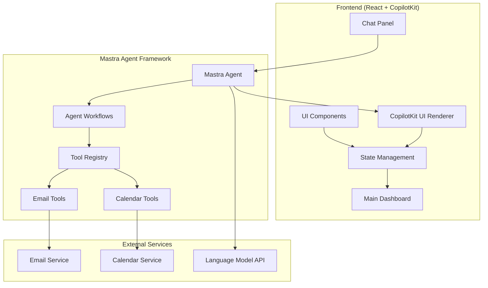

# Design Document: Generative UI Dashboard

## Overview

The Generative UI Dashboard is a React-based web application that provides an intelligent personal assistant interface with real-time email and calendar management capabilities. The system leverages **Mastra** as the LLM agent framework for orchestrating AI operations and **CopilotKit** as the agentic UI render framework for dynamic component generation.

The application features a split-panel layout with a chat interface on the right for natural language interaction with Mastra agents, and a main dashboard area that dynamically displays the status and results of AI-initiated tool calls. CopilotKit handles the generation of adaptive UI components that change based on AI operation context, while Mastra manages the underlying agent workflows and tool execution.

## Architecture

### High-Level Architecture

````mermaid
graph TB


### Component Architecture

The application follows a component-based architecture with clear separation of concerns, leveraging both Mastra and CopilotKit:

- **Layout Components**: Handle the overall application structure and responsive design
- **Chat Components**: Manage conversation flow with Mastra agents
- **Dashboard Components**: Display metrics, status updates, and dynamic content
- **Mastra Integration**: Handle agent communication and workflow execution
- **CopilotKit Components**: Dynamically generated UI based on agent responses
- **Tool Status Components**: Show real-time progress of Mastra tool execution

### State Management Strategy

The application uses a centralized state management approach to handle:
- Chat conversation history with Mastra agents
- Mastra workflow execution status and progress
- Dashboard metrics and data
- Real-time updates and notifications
- CopilotKit dynamic UI component state

## Components and Interfaces

### Core Components

#### AppLayout
- **Purpose**: Main application container with split-panel layout
- **Props**: None (root component)
- **State**: Layout configuration, panel sizes
- **Responsibilities**:
  - Render chat panel and main content area
  - Handle responsive layout adjustments
  - Manage panel resizing
  - Initialize Mastra and CopilotKit providers

#### ChatPanel
- **Purpose**: Right-side chat interface for Mastra agent interaction
- **Props**: `messages: Message[]`, `onSendMessage: (message: string) => void`
- **State**: Input text, loading states
- **Responsibilities**:
  - Display conversation history with Mastra agents
  - Handle user input and message sending
  - Show typing indicators and agent processing states
  - Integrate with Mastra's chat interface

#### Dashboard
- **Purpose**: Main content area displaying productivity metrics and agent activity
- **Props**: `metrics: DashboardMetrics`, `activities: MastraActivity[]`
- **State**: Selected views, filter states
- **Responsibilities**:
  - Render productivity overview cards
  - Display Mastra agent activity status section
  - Show upcoming events and priority inbox
  - Host CopilotKit dynamic components

#### MastraAgentInterface
- **Purpose**: Integration layer for Mastra agent communication
- **Props**: `agentConfig: MastraConfig`, `onWorkflowUpdate: (update: WorkflowUpdate) => void`
- **State**: Agent connection status, active workflows
- **Responsibilities**:
  - Manage Mastra agent lifecycle
  - Handle workflow execution and monitoring
  - Process tool call results
  - Emit status updates to UI components

#### CopilotUIRenderer
- **Purpose**: CopilotKit integration for dynamic UI generation
- **Props**: `agentResponse: AgentResponse`, `context: UIContext`
- **State**: Generated component state, interaction handlers
- **Responsibilities**:
  - Parse Mastra agent responses for UI generation
  - Render CopilotKit components dynamically
  - Handle user interactions with generated UI
  - Maintain component state and lifecycle

#### AIActivityStatus
- **Purpose**: Real-time display of Mastra workflow execution progress
- **Props**: `activities: MastraActivity[]`, `onActivityUpdate: (activity: MastraActivity) => void`
- **State**: Activity filters, expanded states
- **Responsibilities**:
  - Show current and recent Mastra workflows
  - Display progress indicators and status updates
  - Handle workflow state transitions
  - Provide detailed execution logs
- **Props**: `componentSpec: UIComponentSpec`, `data: any`
- **State**: Component-specific state
- **Responsibilities**:
  - Parse AI-generated UI specifications
  - Render appropriate React components
  - Handle dynamic component interactions

### Data Interfaces

#### Message Interface

```typescript
interface Message {
	id: string
	content: string
	sender: 'user' | 'assistant'
	timestamp: Date
	mastraWorkflows?: MastraWorkflow[]
	copilotComponents?: CopilotComponent[]
}
```

#### MastraActivity Interface

```typescript
interface MastraActivity {
	id: string
	workflowId: string
	type: 'email' | 'calendar'
	operation: string
	status: 'processing' | 'completed' | 'error'
	progress?: number
	details: string
	timestamp: Date
	result?: any
	agentId: string
}
```

#### MastraWorkflow Interface

```typescript
interface MastraWorkflow {
	id: string
	name: string
	agentId: string
	tools: MastraTool[]
	status: 'pending' | 'executing' | 'completed' | 'failed'
	context: Record<string, any>
	result?: any
	error?: string
}
```

#### CopilotComponent Interface

```typescript
interface CopilotComponent {
	id: string
	type: 'calendar-view' | 'email-draft' | 'schedule-form' | 'metrics-card'
	props: Record<string, any>
	context: UIContext
	interactions: ComponentInteraction[]
}
```

#### DashboardMetrics Interface

```typescript
interface DashboardMetrics {
	emailsProcessed: number
	emailsTrend: number
	eventsScheduled: number
	eventsTrend: number
	conflictsFound: number
	upcomingEvents: Event[]
}
```

## Data Models

### State Structure

The application state is organized into logical domains:

```typescript
interface AppState {
	chat: {
		messages: Message[]
		isLoading: boolean
		currentInput: string
		activeAgent: string
	}

	dashboard: {
		metrics: DashboardMetrics
		activities: MastraActivity[]
		upcomingEvents: Event[]
		priorityInbox: EmailSummary[]
	}

	mastra: {
		agents: MastraAgent[]
		activeWorkflows: MastraWorkflow[]
		workflowHistory: MastraWorkflow[]
		agentStatus: Record<string, AgentStatus>
	}

	copilot: {
		activeComponents: CopilotComponent[]
		componentHistory: CopilotComponent[]
		uiContext: UIContext
	}

	ui: {
		layout: LayoutConfig
		notifications: Notification[]
		dynamicComponents: UIComponentSpec[]
	}
}
```

### Event Models

#### Event Interface

```typescript
interface Event {
	id: string
	title: string
	startTime: Date
	endTime: Date
	location?: string
	attendees: string[]
	status: 'confirmed' | 'tentative' | 'cancelled'
}
```

#### EmailSummary Interface

```typescript
interface EmailSummary {
	id: string
	subject: string
	sender: string
	timestamp: Date
	priority: 'high' | 'medium' | 'low'
	isRead: boolean
	hasAttachments: boolean
}
```

### Real-time Update Models

#### StatusUpdate Interface

```typescript
interface StatusUpdate {
	activityId: string
	status: AIActivity['status']
	progress?: number
	message?: string
	timestamp: Date
}
```

#### UIComponentSpec Interface

```typescript
interface UIComponentSpec {
	type: 'calendar-view' | 'email-draft' | 'schedule-form' | 'metrics-card'
	props: Record<string, any>
	layout: {
		position: 'main' | 'sidebar' | 'modal'
		size: 'small' | 'medium' | 'large'
	}
}
```

## Correctness Properties

_A property is a characteristic or behavior that should hold true across all valid executions of a system—essentially, a formal statement about what the system should do. Properties serve as the bridge between human-readable specifications and machine-verifiable correctness guarantees._

### Property 1: Message Processing and Response Generation

_For any_ valid user message sent through the chat interface, the system should process the input and generate an appropriate AI response that appears in the conversation history in chronological order
**Validates: Requirements 1.2, 1.3**

### Property 2: Tool Call Routing

_For any_ user request mentioning email or calendar management tasks, the system should initiate the appropriate tool calls based on the request content and intent
**Validates: Requirements 1.5, 3.1, 4.1**

### Property 3: AI Activity Status Lifecycle

_For any_ AI tool call execution, the system should transition through the correct status sequence (processing → completed/error) and display appropriate status information at each stage
**Validates: Requirements 2.2, 2.3, 2.4**

### Property 4: Activity History Persistence

_For any_ completed AI activity, the system should store it in the activity history with accurate timestamps and maintain chronological ordering
**Validates: Requirements 2.6**

### Property 5: Progress Information Display

_For any_ ongoing AI operation, the system should display detailed progress information that updates as the operation progresses
**Validates: Requirements 2.5**

### Property 6: Email Operations Support

_For any_ email-related operation (scanning, drafting, sending), the system should execute the operation successfully and provide appropriate feedback on the results
**Validates: Requirements 3.4, 3.5**

### Property 7: Calendar Operations Support

_For any_ calendar-related operation (scheduling, conflict detection, event management), the system should execute the operation successfully and display appropriate results
**Validates: Requirements 4.2, 4.3, 4.4**

### Property 8: Dashboard Metrics Updates

_For any_ completed email or calendar operation, the system should update the corresponding dashboard metrics (counts, trends, statistics) to reflect the new state
**Validates: Requirements 3.2, 5.1, 5.2, 6.4**

### Property 9: Conflict Detection and Visualization

_For any_ scheduling conflict detected during calendar operations, the system should highlight the conflict with appropriate visual indicators
**Validates: Requirements 5.3**

### Property 10: Event Information Display

_For any_ upcoming event, the system should display complete information including time, title, and location when available
**Validates: Requirements 5.5**

### Property 11: Daily Briefing Content

_For any_ day with processed emails and scheduled events, the system should generate a daily briefing that includes accurate counts and summaries of both
**Validates: Requirements 5.4**

### Property 12: Real-time UI Updates

_For any_ AI operation in progress or status change, the system should update the UI immediately without requiring manual refresh, including chat messages, dashboard metrics, and activity status
**Validates: Requirements 6.1, 6.2, 6.3**

### Property 13: Dynamic UI Component Generation

_For any_ AI tool call result, the system should generate appropriate UI components that match the operation type and provide relevant interactive functionality
**Validates: Requirements 7.1, 7.2, 7.3**

### Property 14: Layout Adaptation

_For any_ type of AI operation being performed, the system should adapt the layout appropriately to accommodate the operation-specific UI components
**Validates: Requirements 7.4**

### Property 15: Styling Consistency

_For any_ set of dynamically generated UI components, the system should maintain consistent styling and visual design across all components
**Validates: Requirements 7.5**

## Error Handling

### Error Categories

#### Network and API Errors

- **Email Service Failures**: Handle email API timeouts, authentication failures, and service unavailability
- **Calendar Service Failures**: Manage calendar API errors, sync issues, and permission problems
- **LLM Service Errors**: Handle model unavailability, rate limiting, and response parsing failures

#### User Input Errors

- **Invalid Requests**: Gracefully handle ambiguous or impossible requests
- **Malformed Input**: Sanitize and validate user input to prevent injection attacks
- **Empty or Null Input**: Provide helpful feedback for empty messages or missing data

#### System State Errors

- **Concurrent Operations**: Handle conflicts when multiple operations access the same resources
- **State Corruption**: Detect and recover from inconsistent application state
- **Memory Limitations**: Manage large datasets and prevent memory overflow

### Error Recovery Strategies

#### Graceful Degradation

- Display cached data when real-time updates fail
- Provide offline functionality for basic operations
- Show appropriate loading states during service recovery

#### User Feedback

- Display clear, actionable error messages
- Provide retry mechanisms for transient failures
- Offer alternative actions when primary operations fail

#### Automatic Recovery

- Implement exponential backoff for API retries
- Queue operations during temporary service outages
- Restore application state from local storage when possible

### Error Monitoring

- Log all errors with sufficient context for debugging
- Track error patterns to identify systemic issues
- Provide error reporting mechanisms for user feedback

## Testing Strategy

### Dual Testing Approach

The testing strategy employs both unit testing and property-based testing to ensure comprehensive coverage:

**Unit Tests**: Verify specific examples, edge cases, and error conditions

- Component rendering and interaction
- API integration points
- Error handling scenarios
- User interface behavior

**Property Tests**: Verify universal properties across all inputs

- Message processing correctness
- Tool call routing accuracy
- Status transition integrity
- Real-time update consistency

### Property-Based Testing Configuration

**Testing Framework**: Fast-check (for TypeScript/JavaScript)

- Minimum 100 iterations per property test
- Each property test references its design document property
- Tag format: **Feature: generative-ui-dashboard, Property {number}: {property_text}**

**Test Categories**:

1. **Mastra Integration Properties**: Test agent communication and workflow execution
2. **CopilotKit Properties**: Test dynamic UI generation and component interactions
3. **State Management Properties**: Verify state transitions and data consistency
4. **Real-time Properties**: Verify immediate updates and synchronization

### Unit Testing Focus Areas

**Component Testing**:

- Chat panel message display and input handling
- Dashboard metric rendering and updates
- AI activity status component behavior
- Dynamic UI component generation

**Integration Testing**:

- LLM service integration
- Email and calendar API interactions
- State management and data flow
- Real-time update mechanisms

**Error Scenario Testing**:

- Network failure handling
- Invalid input processing
- Service unavailability responses
- State corruption recovery

### Test Data Management

**Mock Data Generation**:

- Realistic email and calendar data for testing
- Various user input scenarios and edge cases
- Different AI response formats and tool call results
- Error conditions and failure scenarios

**Test Environment Setup**:

- Isolated test environment with mock services
- Consistent test data across test runs
- Automated test data cleanup and reset
- Performance benchmarking capabilities
````
